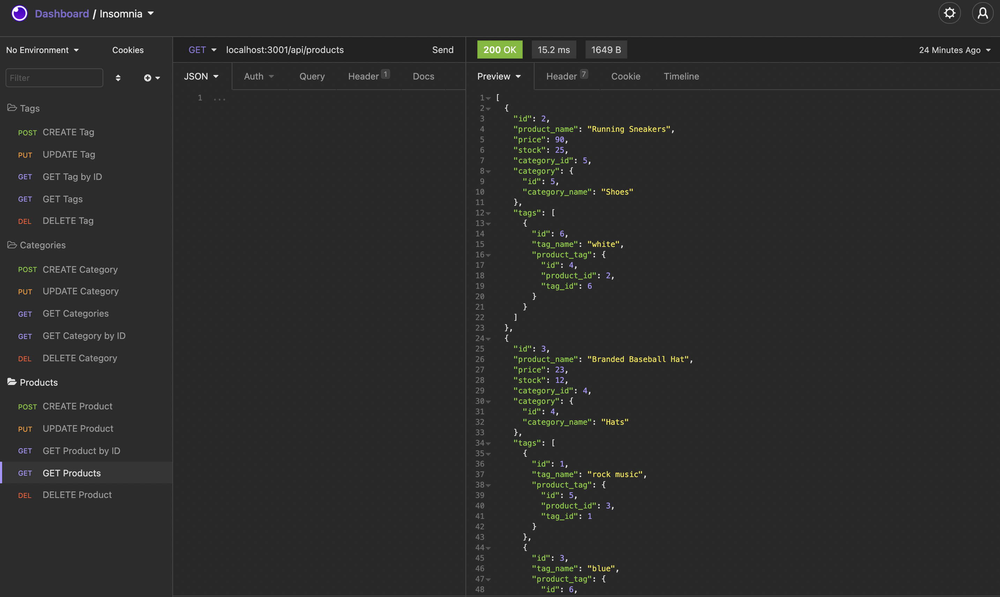
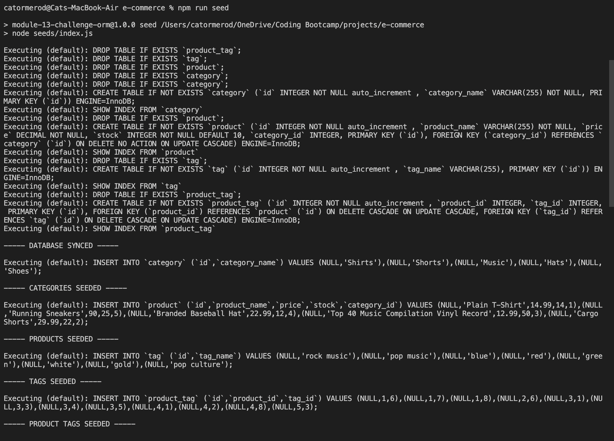
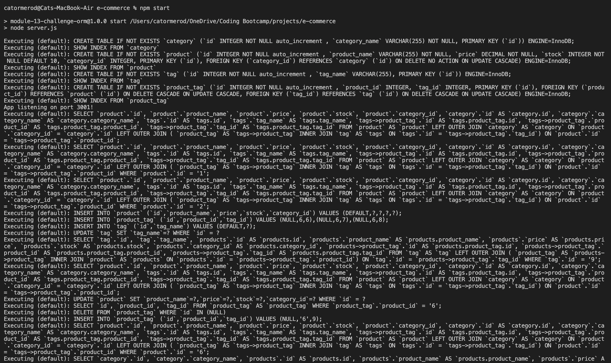

# e-commerce
our task is to build the back end for an e-commerce site by modifying starter code. You’ll configure a working Express.js API to use Sequelize to interact with a MySQL database.

## Description & FULL Demo
---
This e-commerce application showcases mysql, sequalize and express in action.  The demo video [here](https://drive.google.com/file/d/1jBKEGWQj50MlDAi8pekpBwtWBqF5Bg5f/view?usp=sharing) will show the full capabilities of the application.  For more information see below.  

## Screenshots
---
The following images show the web application's appearance and functionality: 

## Tools & Technologies
---
    - mysql - we used mysql2 in this instance so I used promises
    - express
    - sequalize
    - dotenv to hide personal data

## Installation
---
Step 1 - Clone the github repo

Step 2 - Enter your details in the EXAMPLE .env file and save as .env

Step 3 - Right click the server.js file and `Open in intergrated Terminal`, and run `npm i` to install dependancies

Step 4 - Enter `mysql -u <username> -p` in terminal (this will open sql shell)

Step 5 - Enter your password

Step 6 - Enter `source db/schema.sql`, once this has run enter `quit` to exit the shell

Step 7 - Enter `npm run seed` to seed the test data into the database

Step 8 - Enter `npm start` to open the server connection

Step 9 - Open Insomnia Core and test all routes on localhost:3001 e.g. `localhost:3001/api/categories` / `localhost:3001/api/tags` / `localhost:3001/api/products` / `localhost:3001/api/categories/:id`

## Questions?
---
  If you have any questions about this project, please contact me directly on [email](mailto:catormerod@gmail.com). You can view more of my projects at [Github](https://github.com/catormerod) or this specific project at [e-commerce](https://github.com/CatOrmerod/e-commerce). 

  The demo video can be viewed at the following link: [Demo Video](https://drive.google.com/file/d/1jBKEGWQj50MlDAi8pekpBwtWBqF5Bg5f/view?usp=sharing)